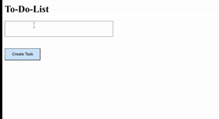

# ToDoList-App

## Exercise Course-Module 3 - Intro Single Page Application (SPA) - HTML/CSS/JavaScript

created at 27.01.23;

As a first step in SPA-Module, I learned to work with Document Object Model (DOM-Manipulation).
Created a To-Do List App with an `input` field where the user is able to add items to the todo list via a `create task-button`. The user can also delete every single item through a `x-button`.

### My Version:

### Mockup:

